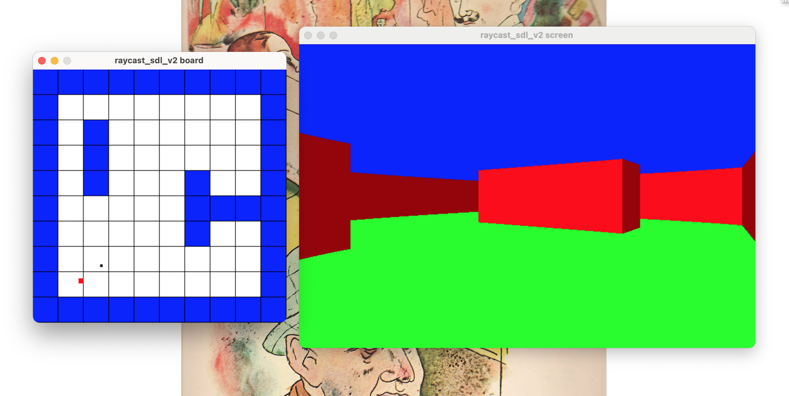

# raycast_sdl3
This is a simple raycasting program written in C with raycast_sdl3



### Requirements
- CMake
- SDL3

### Building with makefile
This should work if you're on a mac.
NOTE: The included makefile will automatically run the program
```zsh
git clone https://github.com/nfriel/raycast_sdl3
cd raycast_sdl3
make
```
If this does not work for you, ensure SDL3 is installed according to official instructions.
If you're using a PC, try changing clang to gcc

### Building with CMake
```zsh
git clone https://github.com/nfriel/raycast_sdl3
cd raycast_sdl3
mkdir build
cmake -S src -B build
cd build
make
./nf_raycast
```
